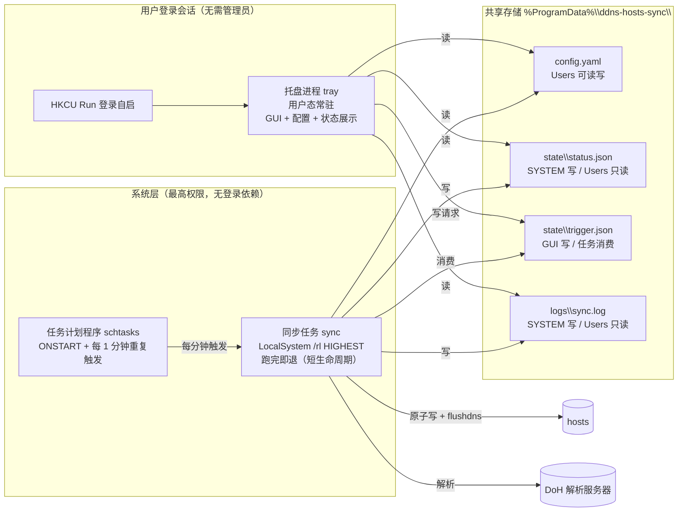

# ddns-hosts-sync 架构设计方案

> 目标原则贯穿全文：**目标用户是普通同事，所有机制以"安装右键管理员运行一次 → 此后零交互"为准绳**。凡是需要用户再点一次 UAC、再输命令的设计，一律否决或降级为"尽力而为 + 自动兜底"。

---

## 0. 现状评估（里程碑 0 结论）

| 项 | 现状 | 结论 |
|---|---|---|
| 代码 | 无任何 `.go` / 项目文件 | 从零初始化 `go mod` |
| git | `.git/` 已初始化（空仓库） | 直接使用，首个提交为 M0 骨架 |
| 需求归档 | `chat-export-1790185252751.json` | 只读保留，作为需求溯源；建议 M0 时移入 `docs/` 并在 README 中说明来源 |

---

## 1. 总体架构

### 1.1 三方拓扑：两个进程 + 一个系统任务

本工具实际由**三个执行体**协作，其中"提权进程"不是常驻进程，而是**计划任务按分钟触发的短生命周期进程**：



**角色职责划分：**

| 执行体 | 权限 | 生命周期 | 职责 | 禁止做的事 |
|---|---|---|---|---|
| 托盘 UI（`tray`） | 普通用户 | 用户登录期间常驻 | 配置管理（增删改条目/全局设置）、状态展示、手动"立即同步"请求、日志查看、托盘图标状态 | **不做任何 DNS 解析、不读写 hosts、不触碰计划任务** |
| 同步任务（`sync`） | LocalSystem | 每分钟被系统拉起，跑完即退 | 读 config → DoH 解析（含 CNAME 递归）→ 变化检测 → 原子写 hosts → flushdns → 更新 status/日志；消费 trigger 中的"立即同步/重配置"请求 | 无 GUI、不监听用户输入 |
| 安装/卸载（`install`/`uninstall`） | 需一次 UAC | 一次性 | 拷贝程序、注册/注销计划任务、设置目录 ACL、生成默认 config、写 HKCU Run、可选恢复 hosts | 用户在安装完成后不再需要任何提权操作 |

### 1.2 关键权衡：定时调度归属 → 推荐"同步任务自持调度"

| 候选方案 | 调度者 | 优点 | 致命缺点 |
|---|---|---|---|
| A：托盘调度 | 用户态进程 | 实现直觉，与 GUI 紧耦合 | 用户未登录则彻底停摆；托盘崩溃同步中断且无人知；解析结果要跨进程转交提权侧写 hosts，通信复杂化 |
| **B：计划任务调度（推荐）** | 每分钟被系统触发的短进程，进程内判断 `距上次同步 ≥ interval` | 见下方理由 | 触发粒度为 1 分钟，interval 最小值随之受限 |
| C：混合 | 托盘解析 + 任务只写 | 解析可复用用户态网络环境 | 解析逻辑双份（托盘与任务各一套），且"预解析结果"要跨 ACL 传递，复杂度最高 |

**推荐 B，理由：**

1. **解析虽不需提权，但"解析→比对→写→report"作为单条链路整体放在提权侧最简**——LocalSystem 有网络访问权，DoH 解析完全可用；结果直接落盘 `status.json` 供 UI 读取，**零跨进程解析结果传递**；
2. **短生命周期天然自愈**：任务进程崩溃/被杀/被误杀，下一分钟系统照常拉起新实例；无需守护进程、无需看门狗、无内存泄漏/句柄泄漏积累；
3. **不依赖登录会话**：LocalSystem + ONSTART 触发保证"开机即同步"，这正是"唯一一次 UAC 后零交互"的保障——用户根本不需要"记得打开托盘程序"；
4. **改配置零提权重注册**：任务每分钟醒来都重读 `config.yaml`，interval 的调整只是进程内一个 `now >= last_run + interval` 判断，**GUI 改间隔即时生效，无需重新注册任务**；
5. 每分钟冷启动一个 50ms 级进程、无网络请求时即退，开销可忽略。

**代价与对策：**
- 计划任务重复触发最小粒度 1 分钟 → 全局 interval 下限设为 1 分钟（产品语义上对 DDNS 轮询绰绰有余）；
- "立即同步"的最坏延迟是下一个 1 分钟窗口 → 见 1.3 的 trigger 机制（写请求 + `schtasks /run` 尽力即时，失败自动兜底到下一分钟）。

### 1.3 进程间通信：status.json 与 trigger.json

**设计原则**：不搞双向同步协议、不搞锁服务。**消息只往一个方向流动**（GUI→trigger，任务→status），单一消费者、单一生产者，从根上消灭并发竞争。文件均位于 `%ProgramData%\ddns-hosts-sync\state\`。

#### trigger.json（GUI 写，任务消费，"请求"通道）

| 字段 | 类型 | 说明 |
|---|---|---|
| `version` | int | 协议版本，固定 1 |
| `request_id` | string | UUID，GUI 每次生成，幂等去重用 |
| `requested_at` | string | RFC3339 UTC，任务侧用于新鲜度判断 |
| `action` | string | `sync_now`（立即同步）／`reconfigure`（配置变更后触发，暂预留） |

**写（GUI，普通用户）**：临时文件 `trigger.json.tmp` + `os.Rename` 原子替换，然后尝试 `schtasks /run /tn ddns-hosts-sync` 尽力立即触发（普通用户对 /rl HIGHEST 任务的 /run 可能被拒——**失败静默吞掉**，UI 提示"已排队，将于 1 分钟内执行"，兜底由任务侧新鲜度判断保证）。
**消费（任务，LocalSystem）**：每次启动读取，若存在则按 action 处理，随后**立即 rename 为 `trigger.consumed.<id>.json` 后删除**，实现"恰好消费一次"。任务侧是唯一消费者（计划任务串行），天然无竞争。新鲜度判断：`requested_at` 在本次运行前 2 分钟内视为有效，过期视为无效请求。

#### status.json（任务写，GUI 读，"报告"通道）

| 字段 | 类型 | 说明 |
|---|---|---|
| `version` | int | 协议版本，固定 1 |
| `updated_at` | string | 本次任务结束时的时间（UTC） |
| `next_scheduled_at` | string | 下次实际执行时间（`update_at + interval`） |
| `interval_minutes` | int | 当前生效间隔（与 config 比较，供 GUI 校验） |
| `sync_window` | string | `waiting`（未到间隔，本轮未干活）／`synced`（本轮已干活） |
| `entries[]` | 数组 | 见下方子字段 |
| `hosts_block` | object | 见下方子字段 |
| `task` | object | `{ last_run_at, last_run_ok, last_error }` 任务自身健康状况 |

`entries[]` 子字段：`id`（对应 config 条目 id）、`enabled`、`status`（`ok`／`nxdomain`／`cname_loop`／`timeout`／`dns_fallback`／`write_failed`／`paused`）、`resolved_ips[]`、`resolved_cname_chain[]`（调试用，含最终 A 域名）、`resolved_at`、`error`、`hosts_present`（当前 hosts 中是否含该条目旧值）。

`hosts_block` 子字段：`present`、`content_md5`（当前 hosts 块哈希）、`expected_md5`（本次期望块哈希）、`last_write_at`、`last_write_ok`。**GUI 据此判断"块被外部篡改/删除"（两哈希不一致且 present=false → 红色告警）**。

**写（任务）**：临时文件 + rename 原子替换。仅任务一个写者，无需文件锁；开发者如后续扩展多写者，约定以同目录 `status.lock`（O_EXCL 创建的死锁自愈锁）兜底，本期不实现。
**读（GUI）**：只读，每 10 秒轮询一次文件 mtime + 内容，容忍"读取瞬间 rename 中"的瞬时失败（重试一次即可）。**ACL 上 GUI 对 state/ 目录仅读**，防止界面进程误写状态。

---

## 2. 数据模型

### 2.1 config.yaml（全局唯一配置，GUI 与任务共同消费）

存放于 `%ProgramData%\ddns-hosts-sync\config\config.yaml`，安装时生成默认模板，目录 ACL 为 **Users 可读写**（保证 GUI 免提权编辑）。库：`gopkg.in/yaml.v3`（YAML 解析是唯一必需的第三方基础库；DoH 走标准库 `net/http` + `encoding/json`）。

```yaml
version: 1

global:
  enabled: true                # 全局总开关；GUI"暂停自动同步"即改这里，任务侧醒来看到 false 直接跳过
  interval_minutes: 5          # 全局统一轮询间隔（任务侧做"到点才干活"判断，非任务注册间隔）
  dns:
    mode: doh                  # doh | system
    doh_servers:               # 依次尝试，全部失败回退 system
      - https://cloudflare-dns.com/dns-query
      - https://dns.google/dns-query
    timeout_sec: 15            # 单条目全链路超时
    ip_version: ipv4           # ipv4 | ipv6 | both
  max_cname_depth: 10          # CNAME 链最大深度（防恶意链）
  failure_keep_old: true       # 解析失败时保留 hosts 旧条目（见 4.3，固定为 true，字段保留以备未来放开）
  flush_dns: true              # 写盘后执行 DNS 缓存刷新

entries:                       # 顺序即写入 hosts 的顺序（GUI 支持上移/下移）
  - id: e-01                   # GUI 生成，UUID 短码，稳定不变
    source: entry-a.ddns.net   # 解析源：跟随 CNAME 链直至 A/AAAA，取最终 IP
    target: rd.server.com      # 写入 hosts 的目标域名（可与 source 相同）
    enabled: true
    note: "RustDesk 中继统一入口"
  - id: e-02
    source: nas-home.ddns.net
    target: nas.home
    enabled: true
    note: "家用 NAS"
```

要点：
- `source` 与 `target` 分离是模型核心：**source 决定"查什么"，target 决定"写什么"**；两者可相同（此时等价于普通 DDNS 固化）；
- 条目顺序即 hosts 写入顺序，GUI 提供上移/下移，避免用户为对齐格式而手工改文件；
- 配置校验规则（任务与 GUI 共用同一校验函数）：域名合法性、target 不可为 IP、不得重复 target、interval ≥ 1、depth ∈ [1,30]。

### 2.2 status.json 示例

```json
{
  "version": 1,
  "updated_at": "2026-09-24T02:00:07Z",
  "next_scheduled_at": "2026-09-24T02:05:00Z",
  "interval_minutes": 5,
  "sync_window": "synced",
  "task": { "last_run_at": "2026-09-24T02:00:07Z", "last_run_ok": true, "last_error": "" },
  "entries": [
    {
      "id": "e-01", "enabled": true,
      "status": "ok",
      "resolved_ips": ["203.0.113.42"],
      "resolved_cname_chain": ["entry-a.ddns.net -> relay-alias.example.net -> 203.0.113.42"],
      "resolved_at": "2026-09-24T02:00:03Z",
      "hosts_present": true,
      "error": ""
    },
    {
      "id": "e-02", "enabled": true,
      "status": "timeout",
      "resolved_ips": [],
      "hosts_present": true,
      "error": "全部 DoH 与系统解析超时（15s）"
    }
  ],
  "hosts_block": {
    "present": true,
    "content_md5": "9f2c...",
    "expected_md5": "9f2c...",
    "last_write_at": "2026-09-24T02:00:06Z",
    "last_write_ok": true
  }
}
```

### 2.3 CNAME 递归解析算法要点

```
resolve(source):
    visited = Set()                    # 环检测
    cur = source
    for depth in 0..max_cname_depth:
        if cur in visited:  return ERROR(cname_loop, cur)
        visited.add(cur)
        ans = query_doh(cur, "CNAME/AAAA/A")   # 一次查询按需带 type
        if ans == CNAME:   cur = ans.target;  continue
        if ans == A/AAAA:  return OK(ips, chain)
        if ans == NXDOMAIN: return ERROR(nxdomain, cur)
        # 查询失败：切换下一个 DoH 服务器，全部失败后回退系统解析（net.Resolver），仍失败 → ERROR(timeout)
    return ERROR(too_deep)
```

- **查询顺序**：DoH（`application/dns-json`，纯标准库实现）主用，服务器列表轮换重试（每级查询重试 1 次，每级 3s），全部失败回落系统解析；`ip_version: both` 时 A 与 AAAA 并行查询；
- **环检测**：visited 集合命中即报 `cname_loop`，同时输出环上域名链便于 GUI 展示；
- **结果归一化**：IP 列表排序后序列化（保证块文本确定性，供变化检测）；
- **变化检测 = 逐字节比较期望块文本与现有块文本**：相同则本轮只刷新 `status.updated_at`，**不触碰 hosts**（避免无谓写入与 flushdns）；不同才走 4.2 原子写。

---

## 3. 模块划分与目录结构

```
ddns-hosts-sync/
├── cmd/ddns-hosts-sync/main.go       # 唯一入口：子命令分发
├── internal/
│   ├── config/       # config.yaml 加载/校验/默认模板/保存（GUI 与任务共用同一套校验）
│   ├── model/        # Entry / GlobalConfig / SyncStatus 等纯数据结构
│   ├── resolver/     # DoH 客户端（标准库）+ 系统回退 + CNAME 递归 + 环检测（纯逻辑，无平台差异）
│   ├── hostsfile/    # 标记块解析/合并/原子写/备份（跨平台差异经 Platform 注入）
│   ├── sync/         # 同步编排：读 config→解析→变化检测→写→状态更新（sync 子命令核心，无 GUI 依赖）
│   ├── state/        # status.json / trigger.json 读写 + 原子替换（temp+rename）
│   ├── tasks/        # 计划任务注册/注销/触发（Windows schtasks、macOS launchd、Linux systemd timer）
│   ├── tray/         # fyne 托盘生命周期、图标状态机、单实例锁、右键菜单
│   ├── gui/          # 配置窗口：条目表格、全局设置、状态面板、立即同步、日志视图
│   ├── platform/     # 平台抽象（接口 + 三份实现 windows/ darwin/ linux/）
│   └── logging/      # 轻量滚动日志（按大小 1MB 轮转，保留 1 份），标准库 log 扩展
├── assets/           # 托盘图标（灰/绿/黄/红四态 .ico/.png）、应用图标
├── docs/
│   ├── chat-export-1790185252751.json   # 需求溯源归档（M0 移入）
│   └── user-guide.md                    # 面向普通同事的安装说明（M3）
├── .goreleaser.yml
└── go.mod
```

**包职责硬约束**：`tray`/`gui` 永不 import `hostsfile`/`resolver`；`sync` 永不 import 任何 GUI 包——保证"任务侧不带 GUI 依赖"（fyne 只编译进 UI 入口，任务入口构建时用 build tag 或包划分天然隔离，控制体积）。

### 3.1 子命令设计（单二进制多入口）

| 子命令 | 权限要求 | 用途 |
|---|---|---|
| `tray` | 普通用户 | 托盘 UI（HKCU Run 登录自启） |
| `sync` | LocalSystem（任务注册为 `/ru SYSTEM /rl HIGHEST`） | 一次完整同步循环，跑完退出；任务每分钟触发 |
| `install` | 一次 UAC（右键管理员运行 / 安装包代提权） | 自拷贝到 `%ProgramFiles%\ddns-hosts-sync\`、注册计划任务（XML：ONSTART + 每 1 分钟重复）、建 ProgramData 目录并 icacls 授权、生成默认 config、写 HKCU Run、执行首轮同步；**幂等可重复运行**（升级路径） |
| `uninstall` | 一次 UAC | 注销任务、删除 HKCU Run、删除 ProgramData、恢复 hosts（含块清理，见 4.3）、保留日志副本于安装目录 |
| `version` | 任意 | 打印版本（goreleaser ldflags 注入） |

**计划任务注册要点（Windows）**：`schtasks /create /xml` 一次性创建，XML 含两个触发器——OnStart（开机即起）与 TimeTrigger（重复间隔 `PT1M`、无限期），主体 `"C:\Program Files\ddns-hosts-sync\ddns-hosts-sync.exe" sync /ru SYSTEM /rl HIGHEST`。XML 用标准库 `encoding/xml` 生成。

### 3.2 GUI 配置窗口功能清单（fyne）

**托盘图标**：四色状态（灰=程序未安装/任务未注册；绿=最近一次同步全部 ok；黄=存在 error 状态条目但 hosts 完好；红=写盘失败或 hosts 块丢失/被篡改）；tooltip 显示最近同步时间；**双击打开配置窗口**；右键菜单：打开配置 / 立即同步 / 查看日志 / 暂停同步（写 `enabled:false`）/ 退出（**提示"仅关闭本窗口，后台自动同步不受影响"**）。

**配置窗口（单实例，本地 lockfile 互斥）**：
1. **条目列表区**（主区，表格）：列 = 启用开关 / 源域名 / 目标域名 / 状态徽标（取自 status.json）/ 解析结果 IP / 备注；工具栏：新增、编辑、删除（二次确认）、启用/停用、上移/下移；双击行进入编辑；编辑对话框校验后写 config。
2. **全局设置区**：轮询间隔（分钟，≥1）、DNS 模式（DoH/系统）、DoH 服务器列表、IP 版本、DNS 刷新开关、暂停自动同步。**保存即写入 config.yaml（免提权），生效由下一个任务窗口保证（≤1 分钟）**。
3. **状态展示区**：来自 status.json——最近同步时间、下次同步、任务健康状况、各条目最近错误与 CNAME 链、hosts 块状态（"内容被外部修改"红色告警、操作记录）。
4. **立即同步按钮**：写 trigger（`sync_now`）+ 尽力 `schtasks /run`，按钮侧提示"已请求，最迟 1 分钟内完成"。
5. **日志查看**：最近 200 行滚动展示 + "打开日志目录"（资源管理器定位）。

---

## 4. hosts 读写策略

### 4.1 标记块与写入格式

仅操作标记块，块外内容分毫不动（企业 DNS 内部域名的解析不受干扰）：

```
# 文件其他内容（用户/企业原有条目）保持原样...

# BEGIN ddns-hosts-sync
203.0.113.42	rd.server.com
198.51.100.7	nas.home
# END ddns-hosts-sync
```

- 每行一条：`IP<TAB>target_domain`（沿用 hosts 惯例，TAB 对齐）；
- `ip_version: both` 时同域名多 IP 各占一行；`cname_loop`/`nxdomain` 条目不写入；
- 行尾注释不写"来源域名"（增加解析负担且无信息增益，GUI 能查）；
- 块定位策略：首次无块则**追加到文件末尾**；已有块则按首行/末行锚点替换块间全部内容（块内任何用户手工改动都会被本次同步覆盖，这正是托管语义）。

### 4.2 原子写与备份

1. 读 hosts 全文（若不存在则视为空文件创建）；
2. 在**同目录**写临时文件 `hosts.tmp-ddns-hosts-sync-<pid>`（跨盘 rename 不可靠，必须同目录）→ fsync → `os.Rename` 覆盖（Windows 下 MoveFileEx 语义，Go 已封装）；
3. **写前备份**：本次被替换的旧文件整体复制为 `C:\Windows\System32\drivers\etc\hosts.bak-ddns-hosts-sync`（循环覆盖，只保留最近一版）；
4. 写入成功后执行 flushdns（见 5.1），失败仅记 warning 不阻断；
5. 全程任一环节失败：不删临时文件前先清理，status/hosts_block 记录 `write_failed` 与错误详情。

损坏窗口分析：rename 是原子操作，崩溃最多损失"写入一半"的旧备份文件，hosts 本身要么旧版要么新版——备份保证可手工恢复（GUI 红色告警提示备份路径）。

### 4.3 解析失败 / 暂时不可达的行为

**推荐：保留旧条目（`failure_keep_old` 恒为 true）**。理由：
- DDNS 抖动/单位网络瞬断是常态，**连续性优先于精确性**——普通同事场景下"旧 IP 仍能连"远好于"条目消失、入口直接不可达"；
- hosts 是本地固化，旧值失效的最坏后果是连到旧 IP 失败，而删除的最坏后果是**域名解析完全回落到（可能更混乱的）远端 DNS**，两者风险不对称；
- GUI 侧以黄色徽标 + `error` 字段 + "已 stale N 天"提示让用户知情，但**系统永不自动删除条目**（删除只能由用户显式操作）；
- 若该条目 hosts 中本就不存在且解析失败 → 不写、仅记录错误。

**卸载时恢复语义**：若当前 hosts 块与最后一次 status 记录一致，直接删除块间内容即无损恢复；不一致（被外部修改过）则保留备份文件并在卸载界面提示人工确认。

---

## 5. 平台适配

### 5.1 Windows（主目标，90%+）

| 事项 | 方案 |
|---|---|
| hosts 路径 | `C:\Windows\System32\drivers\etc\hosts`（用 `%SystemRoot%` 解析，勿硬编码 C:) |
| 缓存刷新 | 写盘成功后 `ipconfig /flushdns`（LocalSystem 可执行，禁用回显） |
| 任务注册 | `schtasks /create /xml`（OnStart + 每分钟重复，`/ru SYSTEM /rl HIGHEST`）；注销 `schtasks /delete /f` |
| 立即触发 | `schtasks /run`（尽力，失败静默兜底） |
| UAC 触发 | **不采用"托盘静默拉起提权"**——唯一提权点是安装/更新/卸载（命令行为例右键管理员运行一次）；运行期一切提权动作都走 LocalSystem 任务 |
| 数据目录 | `%ProgramData%\ddns-hosts-sync\`，安装时 `icacls`：根目录 SYSTEM 完全控制；`config\` 追加 Users 读写；`state\`、`logs\` 仅 SYSTEM 写、Users 只读 |
| 托盘自启 | HKCU `Software\Microsoft\Windows\CurrentVersion\Run`（免提权） |

### 5.2 macOS（尽力支持）

- `/etc/hosts`；flush：`dscacheutil -flushcache; killall -HUP mDNSResponder`；
- 任务：root 权限的 LaunchDaemon `/Library/LaunchDaemons/com.ddns-hosts-sync.plist`（`RunAtLoad=true` + `StartInterval=60`，与 Windows 任务同构）；安装需一次管理员授权（zip 包 + 用户拖入或 `sudo` 教程，README 说明）；
- 数据目录 `/usr/local/var/ddns-hosts-sync/`，安装时 `chown root:staff + chmod` 目录 775、config.yaml 664；
- 托盘自启：`~/Library/LaunchAgents`。

### 5.3 跨平台抽象接口（职责级，非代码实现）

`internal/platform` 定义接口，三份实现（build tag 编译期选择，与结构图一致）：

| 接口方法 | Windows | macOS | Linux |
|---|---|---|---|
| `HostsPath()` | %SystemRoot%\…\hosts | /etc/hosts | /etc/hosts |
| `FlushDNSCache()` | ipconfig /flushdns | dscacheutil + mDNSResponder HUP | 尽力（systemd-resolved/nscd 探活，失败静默——Linux 为可选平台） |
| `RegisterTask(cmd, intervalMin)` / `UnregisterTask()` | schtasks XML | launchd plist | systemd timer（降级 cron） |
| `DataDir()` | %ProgramData% | /usr/local/var | /var/lib 或 FHS 约定 |
| `SetupACLs(configDir, stateDir)` | icacls | chown/chmod | chown/chmod |
| `TrayAutostart(enabled)` | HKCU Run | LaunchAgent | ~/.config/autostart |

`resolver`、`hostsfile` 核心、`sync` 编排、`state` 均为纯逻辑，不感知平台；平台差异全部收敛于 `platform` 包。

---

## 6. 实施里程碑

### M0：骨架与协议冻结（本目录现状：空仓库，可直接开工）
- **交付**：`go mod init`、目录骨架、`model`/`config` 的 schema 与校验、`state` 的原子读写 + `status.json`/`trigger.json` 协议文档化、子命令分发骨架、`docs/` 归档 chat-export、首个 git 提交；
- **验证**：`go build ./...` 通过；`version` 子命令输出；单测覆盖 config 校验与原子写（模拟临时目录）。

### M1：命令行全链路可用（无 GUI 也能闭环）
- **交付**：`resolver`（DoH+回退+CNAME 递归+环检测）、`hostsfile`（块管理+备份+原子写）、`sync` 编排（变化检测+状态落盘）、`logging`；
- **验证**：管理员终端手工执行 `sync` 一次 → hosts 出现标记块、status.json 正确、重跑无变化时不写盘（mtime 不变）；单测：CNAME 链/环/超时用本地 mock DoH 服务器断言；用真实 DDNS 域名做集成冒烟。

### M2：计划任务自动化 + 托盘 GUI（产品主体）
- **交付**：`tasks` 三平台注册/注销、`install`/`uninstall`（含 icacls、HKCU Run、默认 config 生成、首次同步）、`tray`（四色状态机、菜单、单实例锁）、`gui` 全功能（条目 CRUD/排序/启停、全局设置、状态面板、立即同步、日志视图）；
- **验证**：全新 Windows 环境——安装 → 无 UAC 交互下五个周期自动同步；GUI 新增条目 ≤1 分钟内生效；停止计划任务模拟故障，托盘转红，恢复任务后自愈；卸载后 hosts 无损还原。

### M3：平台适配、打包与收尾
- **交付**：macOS/Linux 的 `platform` 实现与打包（dmg/tar）、`goreleaser` 正式配置（windows amd64/arm64 zip + 可选 NSIS）、面向普通同事的 `user-guide.md`（"下载→解压→右键以管理员身份运行 install→完成"三步图文）、图标四态资产打磨、端到端测试报告；
- **验证**：三平台 CI 构建产物齐全；macOS 真机冒烟（launchd 任务、flush 生效）；文档由非技术同事按图操作成功率 100%。

---

## 7. 风险清单与未决点

| 风险 | 对策 |
|---|---|
| 企业网络封锁 DoH | 可配置服务器列表 + 自动回退系统解析；条目 status 明示 `dns_fallback` |
| hosts 被组策略/防病毒/其他工具批量覆盖 | 块外不动 + 备份 + 块哈希失配红色告警 + 自动下一周期重写 |
| 普通用户可写 config.yaml | 威胁模型为本机信任用户，可接受；GUI 校验输入防御格式破坏 |
| 多用户同时登录多托盘实例 | 单实例 lockfile，后到者提示并退出 |
| interval 极限抖动（NTP 回拨）| 全部时间戳用 UTC，判断用"相对上次运行"而非"绝对时刻" |
| 卸载残留 | uninstall 幂等、恢复 hosts、日志归档后清理 |

**未决点**（实现期如无必要不引入）：trigger `reconfigure` action 的实际消费方；`ip_version: both` 时 A/AAAA 混合目标在部分老旧 hosts 解析器上的行为差异（采用 IPv4 优先的写入顺序）。

---

设计要点回顾：**调度与解析整体放在 LocalSystem 每分钟短任务内**（自愈、免登录、免 UAC），托盘只做"看的见的手"（配置/状态/请求）；通信只用两个单向文件协议，原子写 + 单一消费者从结构上消灭并发问题；解析失败一律保留旧值，宁连错不删；用户视角整个产品只有"装一次、看一眼托盘颜色"。
